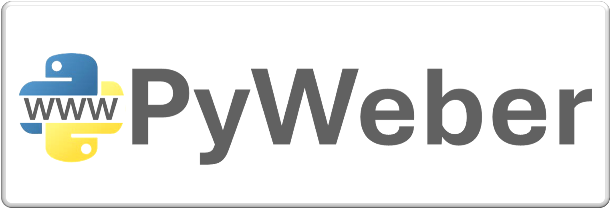

# PyWeber Framework

PyWeber is a simple framework for web development with Python, based on the MVC pattern and using only Python's native libraries.

## Components
- **Router**: Defines routes and handles templates.
- **Template**: Manages template files for HTML rendering.
- **PyWeber CLI**: Command-line tool to facilitate project creation and management.